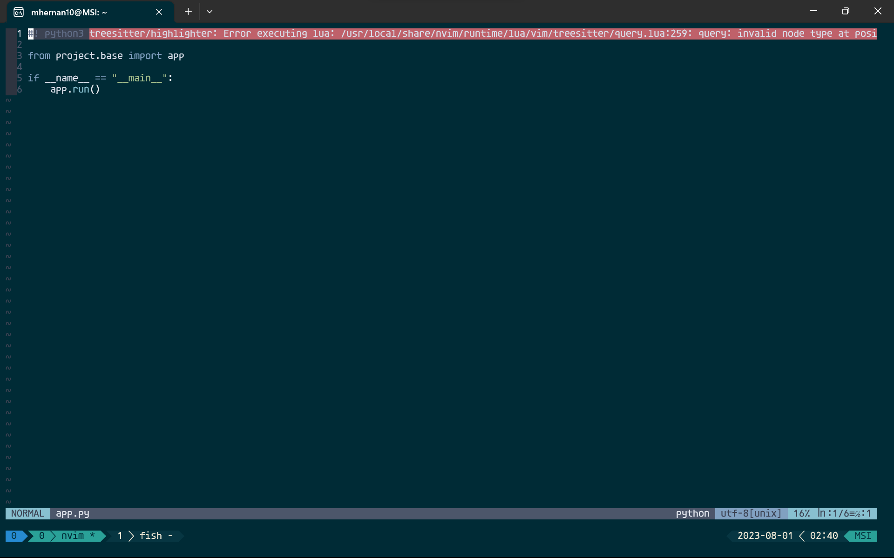

# Debugging

This document contains issues I encounter with neovim.

## Treesitter Highlighter

The following pops up when I open a python script:



### Solution Attempts**

#### Solution 1

1. Open the lazy config and comment out the treesitter plugin
2. Reload the environment, cleanup plugins using `:Lazy`
3. Reinsert treesitter in the config

#### Solution 1 Reasoning

- Basic plugin reset
- The plugins configuration with lazy has a post-install step where the command `:TSUpdate` is executed, the error might be due to a faulty installation

## Pyright LSP Setting Up

I installed the pyright language server by running `pip install pyright`.

I then removed the [`lazy-lsp`](https://github.com/dundalek/lazy-lsp.nvim) configuration and replaced it with a previous configuration that allows the servers to be installed manually.

I am getting the following message from neovim whenever I try to open a Python file:

```log
Error executing vim.schedule lua callback: /usr/local/share/nvim/runtime/lua/vim/lsp/rpc.lua:288: Cannot serialise function: type not supported
stack traceback:
        [C]: in function 'encode'
        /usr/local/share/nvim/runtime/lua/vim/lsp/rpc.lua:288: in function 'notify'
        /usr/local/share/nvim/runtime/lua/vim/lsp.lua:1335: in function ''
        vim/_editor.lua: in function <vim/_editor.lua:0>
```

### Investigation

- When I commented out the `pyright` configuration block in `lsp_config.lua`, the message did not appear when I opened a Python file
- When I removed only the following from the lsp configuration the message did not appear too:
  
  ```lua
  settings = {
    python = {
      analysis = {
        autoSearchPaths = true,
        diagnosticMode = "workspace",
        useLibraryCodeForTypes = true,
        -- venvPath = function()
        --   return "./venv/"
        -- end,
        venv = "venv"
      }
    },
    single_file_support = true
  }
  ```

- It seems the issue might be something to do with the `venvPath`, according to this Github issue, the server can't be sent a function, this explains why this was failing

## Solution

I just changed the `venvPath` to be just the string `"./venv/"`:

```lua
settings = {
    python = {
        analysis = {
        autoSearchPaths = true,
        diagnosticMode = "workspace",
        useLibraryCodeForTypes = true,
        venvPath = "./venv/"
        venv = "venv"
        }
    },
    single_file_support = true
}
```

Not sure if this makes the project find the venv path though.
